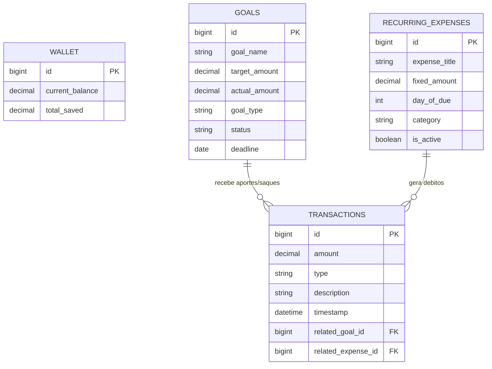

# Economizza API

API REST para gestão financeira pessoal (single-tenant), com controle de carteira, transações e metas financeiras através de caixinhas, garantindo consistência de saldo e atualização automática do status das metas.


---

## Visão Geral

A aplicação centraliza o fluxo financeiro na entidade **Wallet**, permitindo:
- Registro de entradas e saídas
- Histórico de transações
- Criação e gerenciamento de metas financeiras (**Goals**)

O sistema mantém a consistência entre saldo disponível e valores alocados em metas, atualizando automaticamente o status das metas conforme o progresso.

---


## Decisões de Arquitetura

### Adoção de Java Records
O projeto utiliza **Java Records** para todas as classes de transferência de dados (DTOs). Isso garante **imutabilidade** no tráfego de informações, reduz a verbosidade do código e evita efeitos colaterais indesejados durante o processamento das requisições, tornando o fluxo de dados mais previsível e seguro.

### Estratégia de Precisão Financeira
Foi adotado estritamente o uso de `BigDecimal` para representar valores monetários, rejeitando tipos primitivos de ponto flutuante (`double`/`float`). Essa decisão arquitetural previne erros de arredondamento IEEE 754, garantindo a precisão decimal necessária para sistemas contábeis e conformidade com operações aritméticas sensíveis.

### Rastreabilidade
Nenhuma alteração de saldo (`Wallet`) ocorre sem a persistência simultânea de um registro imutável na tabela `Transactions`. Isso garante auditabilidade completa do sistema, permitindo reconstruir o histórico financeiro e identificar a origem de cada centavo movimentado.

## Estrutura do Projeto

```text
src/main/java/com/nakomans/economizza
├── config
│   └── OpenApiConfig.java              # Configuração do Swagger/OpenAPI
│
├── controller
│   ├── GoalController.java             # Endpoints de Metas (Goals)
│   ├── RecurringExpenseController.java # Endpoints de Despesas Fixas
│   ├── TransactionController.java      # Endpoints de Transações
│   └── WalletController.java           # Endpoints de Saldo/Carteira
│
├── dto
│   ├── DepositRequest.java             # Payload para Depósito em Metas
│   ├── ExpenseDTO.java                 # Payload para Criar Despesa
│   ├── GoalDTO.java                    # Payload para Criar Meta
│   └── TransactionRequest.java         # Payload para Registrar Transação
│
├── enums
│   ├── GoalStatus.java                 # IN_PROGRESS, COMPLETED
│   ├── GoalType.java                   # VEHICLE, TRAVEL, HOME, etc.
│   └── TransactionType.java            # INCOME, EXPENSE
│
├── model
│   ├── Goals.java                      # Entidade JPA (Tabela Goals)
│   ├── RecurringExpenses.java          # Entidade JPA (Tabela RecurringExpenses)
│   ├── Transactions.java               # Entidade JPA (Tabela Transactions)
│   └── Wallet.java                     # Entidade JPA (Tabela Wallet)
│
├── repository                          # Interfaces de Acesso a Dados
│   ├── GoalRepository.java            
│   ├── RecurringExpensesRepository.java
│   ├── TransactionRepository.java
│   └── WalletRepository.java
│
└── service
    ├── GoalService.java                # Regras de Negócio de Metas
    ├── NotificationScheduler.java      # Rotinas Agendadas (@Scheduled)
    ├── RecurringExpenseService.java    # Regras de Despesas Recorrentes
    ├── TransactionService.java         # Regras de Registro de Transações
    └── WalletService.java              # Regras de Saldo e Inicialização
```

## Esquema do Banco de Dados

O banco de dados relacional é composto pelas seguintes entidades e relacionamentos:



# Testes e Documentação

## 1. Gere o executável
```bash
mvn clean package -DskipTests
```

## 2. Suba o ambiente
```bash
docker-compose up --build
```

## Documentação e testes via Swagger:
A API expõe uma interface interativa via Swagger, permitindo testar endpoints e visualizar os contratos de dados em tempo real.

**Acesso:**
http://localhost:8080/swagger-ui/index.html

## Como realizar os testes unitários:
### 1. Execute o comando abaixo
```bash
mvn test
```
